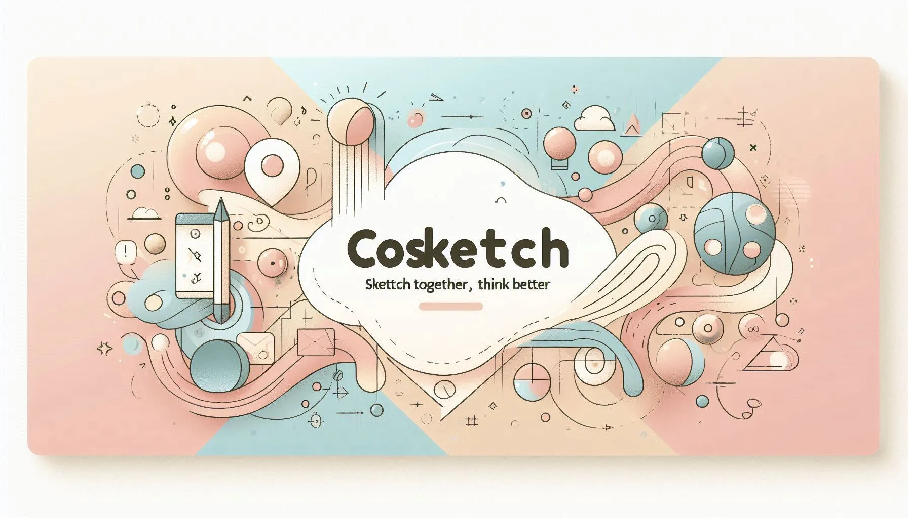

# CoSketch



CoSketch is a **real-time collaborative drawing application** built using **Turborepo** and **Bun**. It includes separate apps for the frontend, backend API, and WebSocket server to enable seamless collaboration.


## 🏗 Project Structure

This monorepo is managed using **Turborepo** and is structured as follows:

```sh
cosketch/
├── apps/ # Contains independent applications
│   ├── cosketch-frontend/        # Next.js app for the UI
│   ├── cosketch-backend/         # Express backend for API handling
│   ├── cosketch-websocket/       # WebSocket server for real-time collaboration
├── packages/ # Shared code across apps
│   ├── database/        # Prisma & PostgreSQL setup
│   ├── types/           # Shared TypeScript types
│   ├── backend-common/  # Common utilities for backend services
├── turbo.json           # Turborepo config file
├── package.json         # Root package.json for Bun & Turborepo setup
└── README.md            # Project documentation
```

---

## 🧩 Features

CoSketch offers a rich set of features for real-time collaborative sketching:

- 🎨 **Shape Drawing**  
  Supports essential diagramming shapes:

  - Rectangle
  - Ellipse
  - Diamond
  - Arrow
  - Line

- ✏️ **Freehand Drawing**

  - Draw freehand lines with customizable brush sizes and colors.

- 📝 **Text Support**

  - Add text labels to your canvas with customizable colors.

- ✏️ **Interactive Editing**

  - Select, drag, and resize shapes with ease.
  - Modify shape styles including color, stroke width, and fill.

- 🗑️ **Shape Management**

  - Delete individual shapes.
  - Clear the entire canvas with one click.

- 🔄 **Real-Time Synchronization**

  - Update and broadcast shape and drawing state across all users using **WebSockets**.

- 🌐 **Multi-User Collaboration**

  - Seamless live editing experience for multiple participants.

- ☁️ **Persistent Storage**

  - Store and retrieve all shapes and drawings from a **PostgreSQL** database via **Prisma ORM**.

- ⚙️ **Modular Architecture**

  - Built with a scalable monorepo structure using **Turborepo** and **Bun**.
  - Decoupled apps for frontend, backend, and WebSocket server.

---

## 🚀 Getting Started

Follow these steps to get **CoSketch** up and running locally:

### Prerequisites

- **Bun** (v1.2.5 or later)
- **Node.js** (v18 or later)
- **Docker** and **Docker Compose** (for PostgreSQL and infrastructure)

### Install Dependencies

Make sure you have **Bun** installed globally, then install all packages:

```sh
bun install
```

### Configure Environment Variables

Create environment files for each app:

1. Copy the example environment files
2. Rename them to `.env` in each app directory
3. Fill in the required values like `DATABASE_URL`, `NEXT_PUBLIC_WS_URL`, etc.


### Run the Application

#### Development Mode

Start all apps in development mode:

```sh
bun run dev
```

This uses Turborepo to run all services concurrently.

#### Production Mode

To build and start all services:

```sh
bun run build
bun run start
```

### Start Individual Apps

You can also start specific apps individually:

```sh
# Start frontend only
bun run start:frontend

# Start backend API only
bun run start:backend

# Start WebSocket server only
bun run start:websocket
```

---

## 📦 Tech Stack

- **Turborepo** → Monorepo management
- **Bun** → Fast JavaScript package manager & runtime
- **Next.js** → Frontend framework
- **Express.js** → Backend API
- **WebSockets** → Real-time collaboration
- **PostgreSQL** → Database
- **Prisma** → ORM for database management

---

## Development Tools

```sh
# Run linting across all packages
bun run lint

# Format code with Prettier
bun run format

# Type checking
bun run check-types
```

---

🚀 **"Sketch Together, Think Better."**
